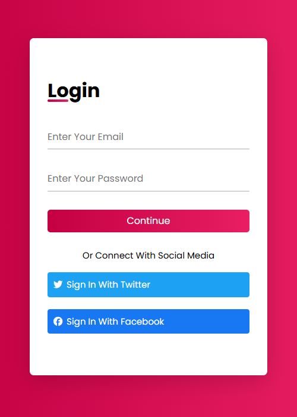

# Animated Login Form 🎨

A modern and animated login form built using **HTML5, CSS3, and Font Awesome** with smooth hover and focus effects.

---

## 📌 Features

- Stylish design with gradient background.
- Smooth hover and focus animations on input fields.
- Integrated with **Font Awesome** for social media icons.
- Login form includes social media sign-in options:
  - Twitter
  - Facebook

---

## 🛠️ Technologies Used

- **HTML5**
- **CSS3** (Flexbox, Animations, Gradients)
- **Font Awesome (via CDN)**
- **Google Fonts (Poppins)**

---

## 📂 Project Structure

Animated-Login-Form/
│
├── index.html
├── css/
│ ├── normalize.css
│ ├── all.min.css # Font Awesome
│ └── style.css # Main styling
└── data/
└── images/ # Screenshots or other images

---

## 🚀 Live Demo

[🔗 View Demo](https://m7med-os.github.io/Animated-Login-Form-using-HTML-And-CSS/)
